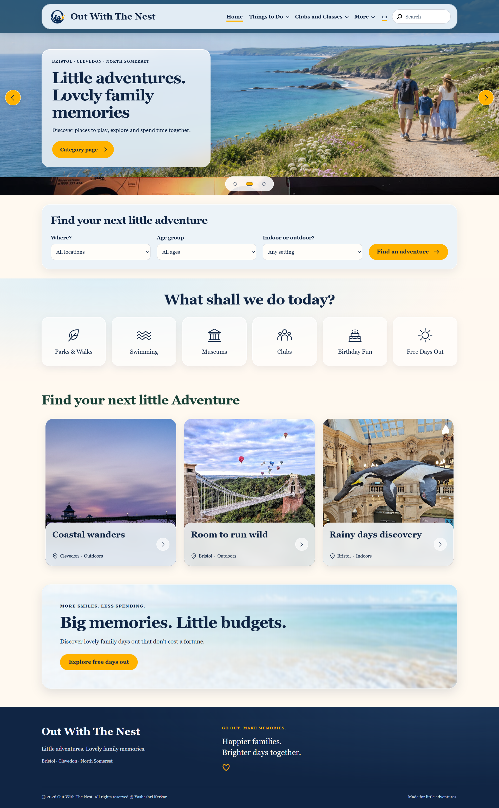
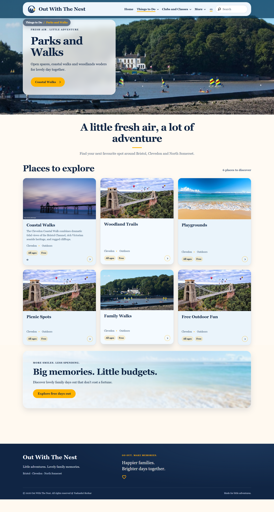

# Out With The Nest - Project Owner Yashashri Kerkar

🌐 [View Live Demo](https://kerkaryashashri.github.io/outwiththenest/)

A static preview of the AEM website, featuring the homepage,
Parks & Walks listing, and Coastal Walks detail page.

**Out With The Nest** is a family activity discovery platform designed to help parents easily find ideas for days out, activities, events, and experiences for children.

## Why I Built This

The idea for this project came from my own experience as a parent.

While speaking with other parents, I realised that we often search for the same types of information: places to visit with children, weekend activities, parks, museums, swimming, birthday venues, indoor and outdoor activities, and local events.

Sometimes families want to plan a special paid experience, while at other times they simply want to spend time together without spending any money.

I wanted to bring these ideas together into one simple and easy-to-use platform.

## Project Goals

The project is designed to:

* Help parents discover family-friendly activities easily
* Support both free and paid activity discovery
* Organise activities by categories such as indoor, outdoor, events, parks, swimming and birthday venues
* Provide reusable and scalable content structures
* Create a responsive and user-friendly experience
* Demonstrate practical Adobe Experience Manager architecture and development

## Technology Stack

* Adobe Experience Manager as a Cloud Service
* Apache Sling
* Sling Models
* HTL
* OSGi
* Java
* HTML
* SCSS / CSS
* JavaScript
* Maven
* Git / GitHub

## Architecture Approach

The project follows a modular AEM architecture where presentation, content and backend logic are separated wherever possible.

The goal is to create components that can be reused across different sections of the website while keeping authoring simple for content editors.

## Implemented Features

* Custom header and navigation
* Homepage hero and category sections
* Reusable activity cards
* Parks and walks listing page
* Activity detail pages
* Editable templates and content policies
* Place map with third-party postcode API integration
* Header and footer Experience Fragments.

## Future Enhancements

* Location-based activity discovery
* Free and paid activity filters
* Indoor and outdoor filters
* Age-based filtering
* Weekend event listings
* Search functionality
* Personalised recommendations

## Purpose of This Repository

Along with building a useful platform for parents, this project is also a practical implementation of my experience with Adobe Experience Manager.

It allows me to explore solution architecture, reusable component development, content modelling, performance considerations and modern AEM development practices through a real-world use case.

Complete AEM site source with authored pages, editable templates and policies,
Experience Fragments, and DAM originals/renditions. Follow [SETUP.md](SETUP.md)
to restore the site on a fresh AEM author and export future author changes to Git.

## Static website demo

A standalone HTML/CSS/JavaScript preview is available in [`docs/index.html`](docs/index.html).
It includes the homepage, a searchable Parks & Walks listing, and a Coastal Walks
detail page using the project's AEM content and images. Open the HTML locally,
or follow the [GitHub Pages publishing steps](docs/DEPLOY.md) to host it.

To refresh the generated pages and selected assets, run `node scripts/build-demo.mjs`.

## Screenshots

### Homepage



### Park and Walks page




## Modules

The project contains these modules:

* **core:** Java bundle containing Sling Models, OSGi services and servlets.
* **it.tests:** Java integration tests.
* **ui.apps:** AEM components and client libraries.
* **ui.content:** Authored site content, templates and assets.
* **ui.config:** Runmode-specific OSGi configurations.
* **ui.frontend:** Frontend assets built using Webpack.
* **ui.tests:** Cypress UI tests.
* **all:** Combined deployment package.
* **dispatcher:** Dispatcher caching and request filtering configuration.
* **ui.apps.structure:** Repository structure required by the application package.

## How to build

Use Java 21 and Maven 3 for local builds.
To build all the modules run in the project root directory the following command with Maven 3:

    mvn clean install

To build all the modules and deploy the `all` package to a local instance of AEM, run in the project root directory the following command:

    mvn clean install -PautoInstallSinglePackage

Or to deploy it to a publish instance, run

    mvn clean install -PautoInstallSinglePackagePublish

Or alternatively

    mvn clean install -PautoInstallSinglePackage -Daem.port=4503

Or to deploy only the bundle to the author, run

    mvn clean install -PautoInstallBundle

Or to deploy only a single content package, run in the sub-module directory (i.e `ui.apps`)

    mvn clean install -PautoInstallPackage

## Documentation

See [SETUP.md](SETUP.md) for local AEM setup, content restoration
and export instructions.

## Testing

There are three levels of testing contained in the project:

### Unit tests

Unit tests are kept in `core/src/test/java`.
Run them from the project root with `mvn clean test`.

### Integration tests

The `it.tests` module contains basic AEM integration tests using AEM Testing Clients.
`GetPageIT` checks that the author homepage and consoles respond successfully.
`CreatePageIT` checks that a test page can be created on author; the test rule
removes the page afterwards.

Start local AEM author and publish instances before running these tests.
From the project root, run:

```sh
mvn clean verify -pl it.tests -Plocal
```

The local profile uses author at `http://localhost:4502` and publish at
`http://localhost:4503`, with `admin` as the default username and password.
If your setup differs, override `it.author.url`, `it.publish.url` and the
corresponding `it.author.user`, `it.author.password`, `it.publish.user` and
`it.publish.password` properties using Maven's `-D` options.

Test classes are kept in `it.tests/src/main/java` and use the `*IT.java` naming pattern.
These tests cover basic AEM operations; they do not yet cover the site's custom features.

### UI tests

The `ui.tests` module contains Cypress UI tests.
See [UI test documentation](ui.tests/README.md) for details.

## Static Analysis

The `all` module uses the AEM Analyser Maven Plugin to validate
the assembled package for AEM as a Cloud Service during the Maven build.

## ClientLibs

The site's styles and scripts are kept in `ui.frontend/src/main/webpack`.
Webpack builds these files, and `aem-clientlib-generator` copies the output into
the client libraries under `ui.apps/src/main/content/jcr_root/apps/outwiththenest/clientlibs`.

`clientlib-site` contains the site CSS, JavaScript and resources. It depends on
`clientlib-dependencies`, which holds the separate dependency bundle.

To build the frontend, run `npm run prod` from the `ui.frontend` directory.
Make styling and script changes in the frontend source files, then rebuild
to update the generated client libraries.
